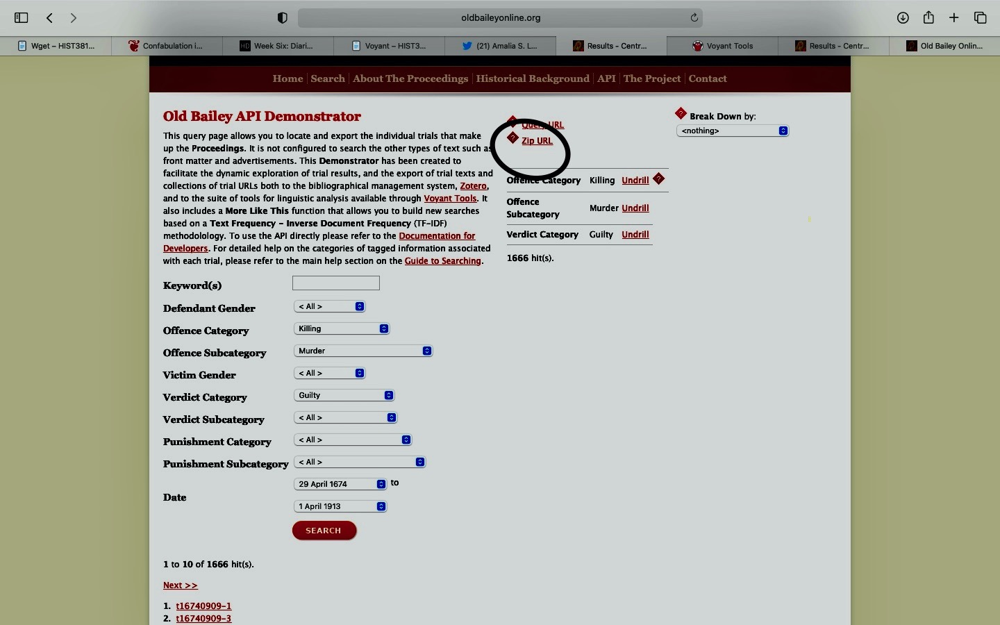

# DIGH 3814: DH Exploration  Exercise
## The process

### Zotero
1. Since I had yet to use Zotero, I followed the steps listed in the tutorial to download the software.
2. After navigating through the tutorial presented by the UCLA website, I learned that I could edit the bibliographic information of a source and include my own notes regarding information presented by the source.
3. I saved the webpage I was thinking of using to gather the information I needed in the StoryMaps portion of my assignment.
4. I played around with Zotero a bit more and saved the DOI linked to the XML data of the Old Bailey Proceedings incase I decided to use this information in the future.

### Voyant
1. I knew that in order to upload a corpus to Voyant, I needed the URL of that corpus (this is not something I knew how to create or find).
2. As each proceeding in the archive had its own individual link, I thought that if I could find a way to collect each link into a single file, I could then upload this file into Voyant.
3. Following this belief, I thought that I could use wget to create such a file.
4. Following the Wget tutorial, I pasted the given script into Atom. In line 3, where it requires a range of numbers, I inputted 1 and 2645 because 2645 was the amount of proceedings that came up when I searched the records for murder trials with guilty convictions. In line 4 where it requires a URL, I typed in the URL for the archive's search directory.

5. I then created a directory called 'wget-oldbailey' and proceeded to save the file with the script titled "urls.py". I assumed that when I ran the file using "python urls.py", it would generate a file with a link to each of the 2645 proceedings I wanted to observe through Voyant. Obviously, my theory was a fail and when I opened the "urls.txt" file, there were indeed 2645 URLS, but each were broken links.
6. I immediately knew why my theory failed. The URL's to each of the proceedings I wanted to observe did not concern the order in which each trial was listed in the search directory. Rather, each URL consisted of a reference number which was unique to each proceeding.
7. I thought that if I used the reference number of the first proceeding that came up in my search as the first number in line 3, and the reference number of the last proceeding listed in my search as the second number in line 3, then I could generate 2645 'valid' URL's.
8. Yet again, I was incorrect. At this point, I noticed that not only did the URL for each proceeding have 2 reference numbers listed, but the reference numbers were not in any specific order because I was doing a specific search and therefore some trials were being left-out of the search, along with their reference numbers.
9. Note: Reflecting back on my numerous theories, I now know that even if I was able to somehow create a script that would compile a list of each of the 2645 URL's I needed, assembling them all together in file is not a 'corpus' and would not be sufficient enough for Voyant to do what I wanted it to do.
10. I had spent a good part of my day trying to figure out how to generate this corpus for Voyant when I did some exploring in the archive. It was here where I noticed that The Old Bailey had actually provided readers with a Zip URL that could be used to upload a corpus to Voyant.

11. I refined my search and then used the Zip URL to upload the corpus to Voyant (finally!)

### StoryMaps
1. I did not experience any issues with StoryMaps as I had used it earlier in the course and I find the platform easy to maneuver.
2. When determining the visual aspects of my presentation, I decided to use a darker map because the pictures I chose to upload were in black and white and so I thought this arrangement went well together.
