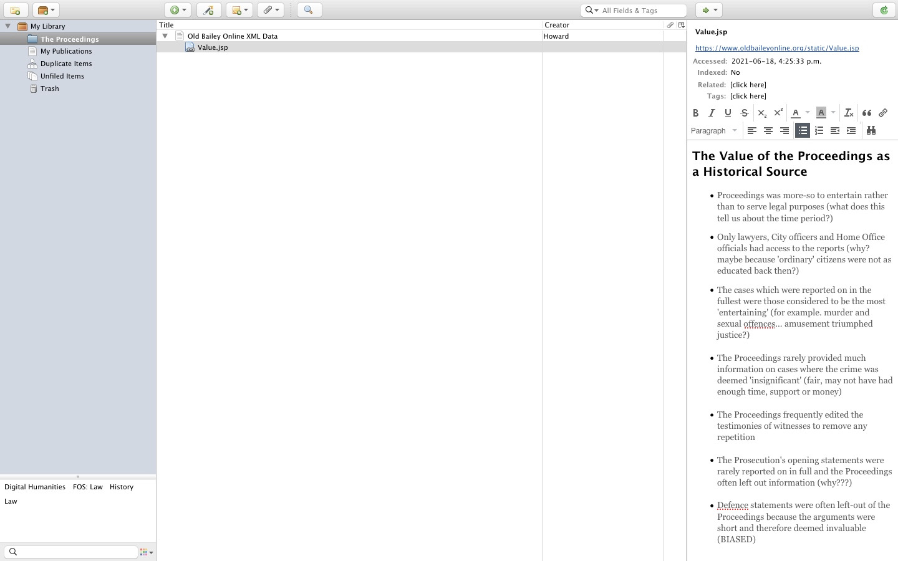
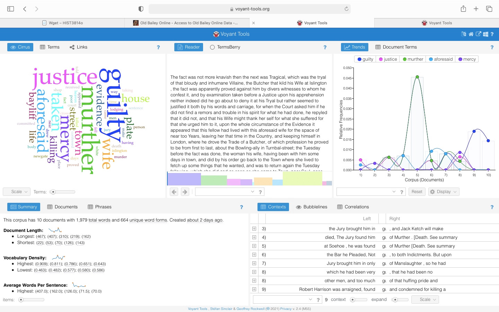

# DIGH 3814: DH Exploration Exercise
## The Results

When reviewing the list of archives compiled by Amalia Skarlatou Levi in her Twitter thread, I noticed that she provided the link to one that covered criminal trials in old England. This archive, called The Proceedings of the Old Bailey, interested me because I am quite passionate about law and after I complete my undergraduate degree, I hope to attend law school and eventually occupy a career as a criminal defence lawyer. Therefore, I was excited to investigate this archive and learn more about the beginnings of criminal proceedings in early England. Although I did experience some bumps along the way, I enjoyed the process of examining the data and I am quite satisfied with the materials I assembled and the observations I made. I was able to use the Zotero, Voyant and StoryMaps tutorials to create observations and test the skills I have learned throughout the course.

### Zotero
For my first tutorial, I chose to use Zotero because I thought it would be useful for the bibliographic components of my assignment and I assume it could be beneficial in future classes where I need to manage my research in an organized fashion. Additionally, as I had yet to use Zotero, I thought it would be a good way to test what I have learned in the course thus far.

As Zotero has the option to include notes for each source saved in the platform, I was able to make comments on the archive as I read through each page and section. This tool was extremely useful when compiling the information I was going to present through StoryMaps and as seen in the image, I was able to make observations and ask questions as I skimmed through the material.

What I enjoyed most about Zotero was that I could put my notes and source information in one place. I found that this reduced my stress about how to organize the points I wanted to get across in StoryMaps. Additionally, posing questions about the information I was reading as I read it helped me contextualize the material. Mostly, I discovered that the Proceedings were quite biased and seemed to place entertaining the public over ensuring that justice triumphed above all. The Proceedings favoured publishing those crimes more 'exciting' over 'invaluable' crimes and often shortened or left-out the accounts of defendants. Evidently, this causes accounts and experiences to be ignored or belittled. This issue reminded me of a reading we studied back in week one which reviewed numerous online platforms that have made the oral histories of minority groups more accessible. The reading, 'Clio, Rewired: Propositions for the Future of Digital History Pedagogy in Canada' by Kimberly Martin recognizes that historically, voices and experiences of specific groups have been ignored by "mainstream history" because they did not fit the standard narrative. Similarly, the Proceedings chose to ignore the accounts of defendants in what I believe an effort to advertise the victim as the "good guy." This must have had damaging impacts on the justice system as it was therefore not operating to serve justice, but rather to uphold a narrative that worked to ensure the victim was seen as the "innocence" party in a case. However, this narrative is dangerous because it assumes that the accused is always guilty, which is incorrect.

Overall, as Zotero allows me to put all of my sources, notes and observations in once place, I was able to look at the information as a whole and then draw questions from the material. I believe that this platform will be helpful to me in my future classes when I need to form research questions or keep my sources together in one place.

### Voyant
After merely skimming through The Proceedings of the Old Bailey, I noticed that the archive focused on what could be told about criminal proceedings in old England through the trial transcripts themselves. Specifically, the archive noted how the language used in the proceedings changed throughout the decades as it went from "judgemental" to, in the words of the archive, "more sober". I found this interesting and I assumed that if I could pinpoint which words were used in such proceedings, then I would be able to learn more about old England itself and the 'early days' of criminal trials. I recalled that back in week three, one of the platforms students could use was called 'Voyant', and although I had not used the software myself, I knew it could be used to analyze text. As you will see in my log.md, my issues with Voyant began promptly due to the fact that I simply just did not know how to create a corpus of the files I wanted to analyze. However, once I solved this issue, my experience with Voyant was quite illuminating!

As seen in the screenshot of Voyant, two of the most commonly used words in the corpus were 'murther' and 'aforesaid'. I found this interesting for multiple reasons. The first, and what I believe the most obvious reason, is that these words stand out because they are no longer used regularly in the english language. According to an online dictionary, 'murther' is an obsolete word and has been replaced by 'murder'. As I refined my search by searching for murder proceedings with guilty convictions, it is not surprising then that the term 'murther' was used quite frequently (according to Voyant, it was used seven times). However, what I did not expect to see was the term 'aforesaid'. Although I had heard of the term, I was not sure of its meaning. After doing a quick Google search, I learned that the term was used when referring to something that had been previously mentioned in conversation (CITE). I could not quite understand why this would be used so often in criminal proceedings. I reviewed the Contexts section in Voyant to find where the term was used in each document and I noticed it was used while explaining a story, for example when referring to someone's family member or previous confession. I did not feel that the use of this term told me much about criminal proceedings during old England. Rather, the regular-use of 'aforesaid' spoke more about the change that has occurred in the english language from old England to now. It makes me question why some words are no longer used while others, such as 'guilty', not only remain used consistently, but still hold the same meaning from decades ago. I do not have the resources or knowledge to answer that question, but I can assume that the reason may be in part due to the fact that words such as 'aforesaid' simply just take up extra space in conversation. I do not think it is necessary to refer to the fact that you are bringing up a topic, person, place etc. that has already been mentioned (I think this because I do not do this, nor have I engaged in a conversation where another person has done this.) Another observation I made was that the term 'guilty' was the word used most frequently in the corpus. As this term is still used in criminal proceedings today to refer to someone who is at fault for their criminal actions, I did not need to research the meaning of the word or it's purpose in criminal law. However, it's use brings me back to my previous question; why are some words in the english language no longer used while others remain just as popular as they were in the 1600's? I believe that the other two words identified by Voyant, 'justice' and 'mercy', speak for themselves as achieving justice has remained a common theme in legal proceedings and a judge can grant mercy to an accused or an accused does not bestow mercy on a victim when murdering them.

Overall, my experiences with Voyant answered some of my questions while simultaneously leaving me with new inquiries. I learned that the language used in criminal proceedings has changed quite significantly over time, but this observation also puzzles me as I cannot quite grasp why this is the case. There was a limit to this research as The Old Bailey could only upload ten documents to a single corpus at a time. This prohibited me from mapping out how the language used in criminal proceedings has progressed throughout the years. If I was able to do this, I would love to study when the term 'aforesaid' seemed to have been 'phased-out' and when the terms commonly used today started to make their appearances.

### StoryMaps
<iframe src="https://uploads.knightlab.com/storymapjs/b90ada26b6aa576fdf2fddcdd324579a/the-old-bailey-proceedings/index.html" frameborder="0" width="100%" height="800"></iframe>
I used StoryMaps in week three to provide information and convey a story about Americans who migrated to Canada in an effort to evade the Vietnam War draft. I enjoyed the platform as it was simple to use, was visually pleasing and successfully communicated the message I was trying to get across. Therefore, when contemplating which tutorial to use in this final assignment, I selected StoryMaps because I wanted to use the feedback I had received regarding my use of the platform, and I believed it would be appropriate for expressing the importance of the proceedings as a historical source.

I believe that using StoryMaps for this assignment was a sufficient way to organize the information I wanted to share about The Old Bailey Proceedings. I took what I considered to be the most important topics and created a slide for each. This ensured that all of the information I wanted to share was being reproduced while simultaneously guaranteeing that the reader would not become overwhelmed with the presentation of too much information at once. What I enjoyed most about using StoryMaps was that because I was only focusing on a small section of text at one time, I was able to process important facts. For example, the last slide of my presentation discusses the fact that the Proceedings left-out a significant amount of information from the trial. When comparing this to how trial reports are written now, it can be concluded that today, trial reports include much more information, including that of which old England deemed 'unnecessary' to include in the Proceedings. Another observation I was able to draw from the data was that the Proceedings appeared to be very bias in that they attempted to weaken the accused's argument by omitting important evidence and details from the defendant's statement. Personally, I am quite unsettled by this as justice cannot prevail if one of the parties in a case are being oppressed by those who have power over what is displayed to the public. The bias present in the Proceedings is very telling of the time period in which they were written and it is evident that defendant's were not treated fairly through the justice system. A final observation I made through the use of StoryMaps is regarding the types of trials covered most frequently by the Proceedings. As explained in StoryMaps, the Proceedings often failed to provide sufficient information for most of the trial reports. However, for those which were deemed 'entertaining', for example, sexual offences or murder, the Proceedings often ensured that the trials were reported on in full. This establishes that the main priority of the Proceedings was not to ensure that the public knew the truth about each trial, but to provide citizens with entertainment and amusement.

StoryMaps granted me with the ability to breakdown information into sections and then make observations from the data I have reproduced. I enjoy that the platform gives me creative abilities as well through its capacity to upload pictures and change the design of the map. However, if I could go further with this platform, I would like to have picked further through the archive to find more examples which prove the fact that the Proceedings were filled with bias and did not work to uphold justice. StoryMaps would assist me with this mission as it makes it easy to organize pieces of information and then present it to an audience. However, it is important to note that the archive itself can only tell me so much about the Proceedings and trial reports in old England. This resembles a point made by Amalia Skarlatou Levi in her Twitter thread as she mentions that what is shown online may not be all that an institution has to offer. The archive does mention that there are other digital archives which hold additional pieces of evidence for cases, background information about defendant's and details about the other individuals involved. I think that if I were to continue to research more about criminal proceedings in old England, it would be vital to use these databases as sources as well.

## Final Words...
Creating this final assignment has been one of my favourite aspects of the course as it gave me the creative ability to not only choose an archive which interested me the most, but I was also able to pose my own questions and then use numerous platforms to answer them. I was excited to combine two of my favourite subjects, history and law, into one project and test what I have learned throughout the course. Despite experiencing some issues, specifically with Voyant, I thoroughly enjoyed diving deep into the archive to make observations about criminal trials and the justice system in old England. Although I was able to make some 'surface-level' conclusions after reading through the archive and making notes in Zotero, being able to use Voyant to complete text-analysis provided me with deeper insights and even more questions about the Proceedings. StoryMaps then presented me with a Platform to share what I believed to be the most important information from the archive while also organizing the material in a way that posed new and obscure questions. For example, I remain unsettled, but not entirely surprised, by the fact that the Proceedings served as a form of entertainment rather than as a platform that worked to ensure justice prevailed. Overall, I enjoyed completing this assignment and I hope that as I continue on in my academic career, I can use the platforms I discovered through DIGH 3814 and approach future research projects digitally. 
